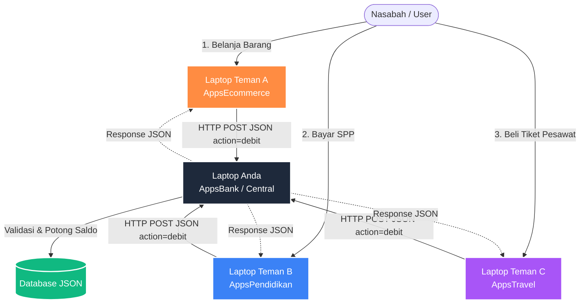

# Presentasi Sistem: AppsBank (Sistem Keuangan Terdistribusi)

Dokumen ini adalah panduan lengkap (contekan) untuk membantu Anda menjelaskan keseluruhan sistem AppsBank saat presentasi besok. Anda bisa membacanya perlahan untuk menguasai alur kerjanya.

---

## 1. Pendahuluan
**"Halo semuanya, hari ini saya akan mendemonstrasikan AppsBank, sebuah purwarupa (prototype) Core Banking System yang dirancang untuk beroperasi di dalam ekosistem Sistem Terdistribusi."**

AppsBank bukan sekadar aplikasi pencatat uang biasa, melainkan bertindak sebagai **Otoritas Pusat Keuangan (Central Authority)**. Aplikasi ini siap menerima *request* transaksi secara *real-time* dari aplikasi luar (seperti Ecommerce, Travel, atau Sistem Pendidikan) tanpa ada campur tangan manusia.

---

## 2. Teknologi yang Digunakan (Tech Stack)
Jelaskan bahwa sistem ini sengaja dibuat ramping (lightweight) dan sangat cepat.

*   **Backend:** **PHP Native (Vanilla PHP)**
    *   *Alasan:* Sangat cepat, tidak membebani server dengan *library* yang berat, dan mudah di-hosting di mana saja (bahkan cukup menggunakan XAMPP lokal).
*   **Database:** **JSON (Flat-file Database)**
    *   *Alasan:* Aplikasi tidak menggunakan MySQL. Semua data (rekening, mutasi, user) disimpan langsung dalam format file `.json`. Keunggulannya: sangat portabel (tinggal *copy-paste* folder langsung jalan), mudah dimonitor, dan ideal untuk demonstrasi arsitektur REST.
*   **Frontend / UI:** **100% Vanilla CSS & HTML5**
    *   *Alasan:* Tidak menggunakan Tailwind, Bootstrap, atau template instan. Semua desain antarmuka (UI) diracik manual dari nol. Menghasilkan desain yang *premium*, *clean*, tanpa batasan *layout*, dan *load time* yang secepat kilat.
*   **Ikon:** **Lucide SVG Icons**
    *   *Alasan:* Menggunakan SVG agar tetap tajam (vector) dan modern.

---

## 3. Konsep Arsitektur (Sistem Terdistribusi)
Jelaskan bagaimana laptop Anda dan laptop teman Anda saling berkomunikasi.

**"Sistem kami menggunakan konsep Arsitektur Sistem Terdistribusi, di mana beberapa node (laptop/server) yang terpisah secara fisik bekerja sama seolah-olah menjadi satu kesatuan sistem."**

*   **Pemisahan Tugas (Separation of Concerns):**
    *   Laptop teman Anda (Sistem Ecommerce) hanya memikirkan urusan jualan barang. Dia TIDAK menyimpan saldo uang user.
    *   Laptop Anda (Sistem Bank) hanya memikirkan urusan validasi uang dan mutasi.
*   **Komunikasi Antar Mesin:**
    Mesin-mesin ini berkomunikasi murni melalui jaringan lokal/internet menggunakan protokol HTTP, bertukar teks dalam bahasa universal yaitu **JSON**.

---

## 4. Konsep REST API (Bagaimana Uang Berpindah)
Ini adalah inti presentasi Anda. Jelaskan bagaimana "ajaibnya" saldo bisa terpotong.

**"Komunikasi antar sistem ini diwujudkan melalui teknologi REST API (Representational State Transfer Application Programming Interface). AppsBank menyediakan satu loket khusus yaitu `api.php`."**

### Cara Kerja REST API di Aplikasi Ini:
1.  **Request (Permintaan):** Saat *user* berbelanja di Ecommerce, aplikasi Ecommerce akan mengirim **HTTP POST Request** ke URL Bank (`http://<IP-BANK>:8000/api.php`).
2.  **Payload (Membawa Data):** Request tersebut membawa "surat" berformat JSON yang isinya:
    *   `action: "debit"` (Perintah untuk memotong saldo)
    *   `no_rek: "100010001"` (Rekening target)
    *   `jumlah: 150000` (Jumlah tagihan)
    *   `sumber: "AppsEcommerce"` (Siapa yang menagih)
3.  **Process & Validate:** Server Bank menerima JSON tersebut, memverifikasi apakah saldo mencukupi.
4.  **Response (Balasan):** Jika saldo cukup, Bank memotong saldo, mencatat mutasi, lalu membalas ke Ecommerce dengan JSON: `{"success": true, "message": "OK"}`. Jika gagal (saldo kurang), membalas dengan `{"success": false}`.
5.  **Audit Trail:** Setiap ada API yang masuk, AppsBank akan langsung mencatatnya di **Monitor Integrasi** sebagai jejak digital.

---

## 5. Fitur Unggulan (Bisa didemokan)
Saat mendemokan, tunjukkan fitur-fitur ini:

*   **Multi-Role & Privasi:** 
    *   Jika *login* sebagai user (contoh: Niam), mereka berada di dalam *sandbox*. Hanya bisa melihat rekening miliknya dan mutasinya sendiri. Desainnya luas dan nyaman.
    *   Jika *login* sebagai `admin` (God View), admin bisa melihat semua sirkulasi uang (*Total Saldo Sistem*, *Outflow*, *Inflow*), seluruh rekening, dan **Monitor Aktivitas API** dari sistem luar.
*   **Real-time Charting:** Grafik batang volume transaksi yang menghitung kalkulasi uang masuk dan keluar 7 hari terakhir secara dinamis.
*   **Log API Real-time:** Halaman *Monitor Integrasi* mencatat persis detik ke berapa aplikasi teman Anda memanggil API Anda, beserta statusnya (Berhasil / Gagal).

---

## 6. Skenario Demo (Saran Urutan Presentasi)
1.  *Login* sebagai **User** (Niam). Tunjukkan bahwa user bisa buka rekening baru dan lihat mutasi kosong/awal.
2.  Minta teman Anda mendemokan checkout di Ecommerce menggunakan rekening milik Niam.
3.  *Refresh* halaman Mutasi si Niam. **Bum!** Saldo berkurang, dan muncul catatan *"Transfer ke ... - Pembayaran Ecommerce"*.
4.  *Logout*, lalu *login* sebagai **Admin**.
5.  Buka **Dashboard** / **Monitor Integrasi**. Tunjukkan log API yang mencatat bahwa baru saja ada *request* masuk (IN) dari *AppsEcommerce* yang mengeksekusi aksi `debit`.

---
*Good luck presentasinya, Bos! Sistem ini udah sangat solid buat dipamerin.*
